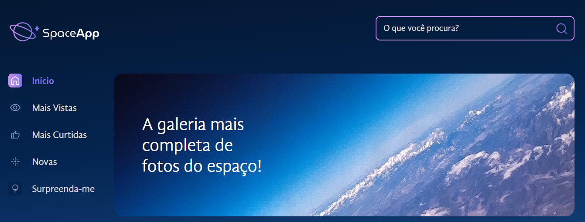

# Space App
  




## Funcionalidades

:heavy_check_mark: Favoritar imagens 

:heavy_check_mark: Dar zoom nas imagens


## Pré-requisitos

:warning: [Node](https://nodejs.org/en/download/)


## Como rodar a aplicação :arrow_forward:

No terminal, clone o projeto: 

```
git clone https://github.com/JenniGabriely01/react-space-app.git
```

Ainda no terminal, entre na pasta dos arquivos:

```
cd space-app
```

Ainda no terminal, inicialize e entre na localhost sugerida:
```
npm run dev
